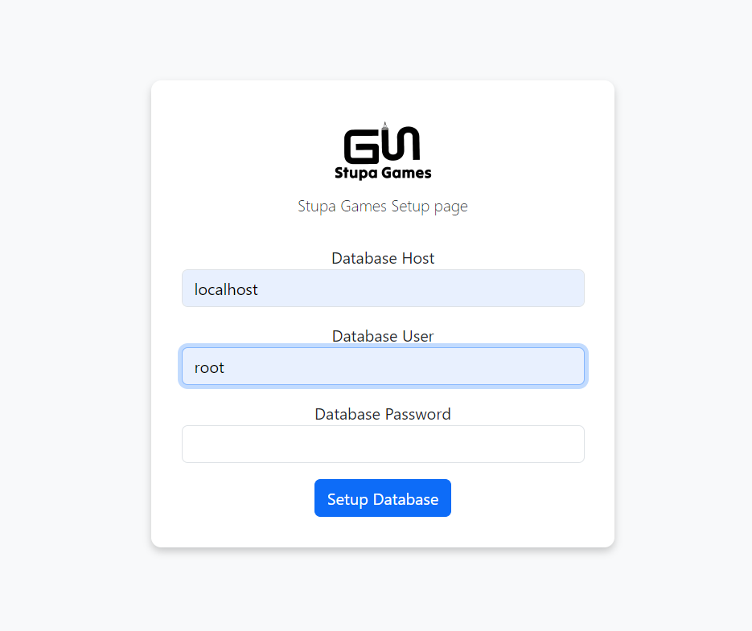
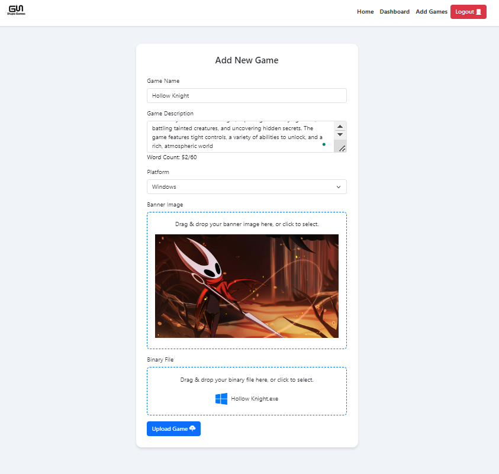
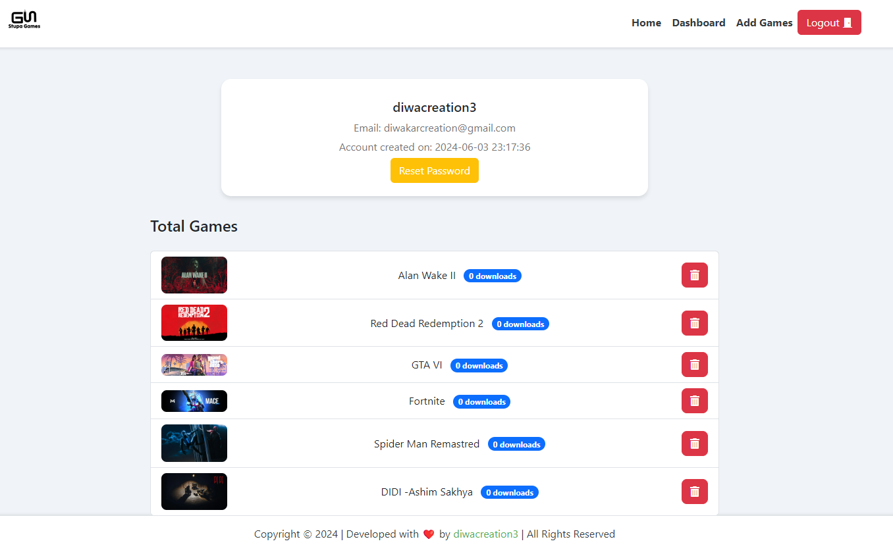
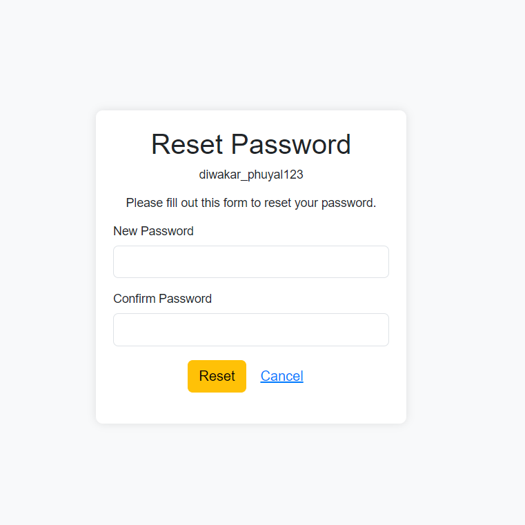

# Stupa Games 🌿
> version 1.0.0

I've endeavored to create a game store akin to itch.io, where developers can host and publish their games on their own servers. As a fellow game developer, I recognized the need for such a platform, and this project encapsulates the skills and knowledge I've acquired during my third semester."  

> Fork it, Use it, Contribute on it

### Features 🌱
- Setup Screen
- Login/ Signup 
- Password Reset
- Clean dashboard

#### This is how it look like 👀

### HomePage 🌺

### Setup Screen 🌻

### SignUp Screen 🪻

###  Login Screen 🌼

### Add Game 🌾

### DashBoard 🍂

### Password Reset 🍃

#### Some fixes Needed  ⚒️
Some ui issue will be fixed 

> Docker Support Coming Soon.....

