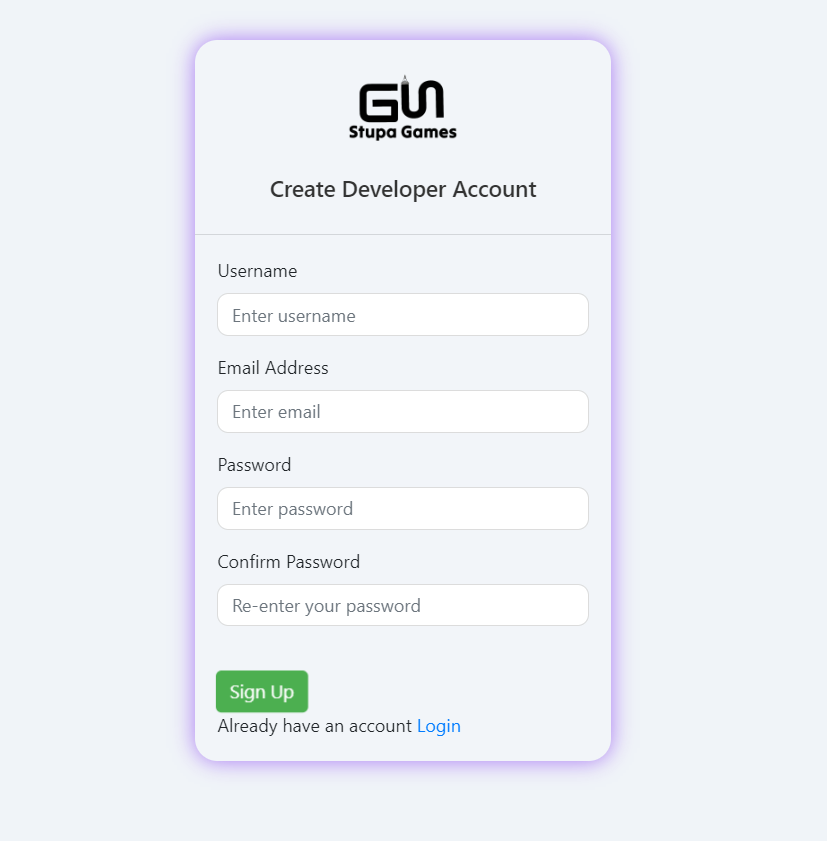

# Game Store
> version 1.0.0

I have try to create game store same as itch.io, Where developer can host on their server and publish their game. i'm also game developer and i thought i need some thing like that, and this project shows what i learned on my third semester.

### UI is not good but here are some showcase images

### Homepage

#### signup

### login 

### manage game

### add game

